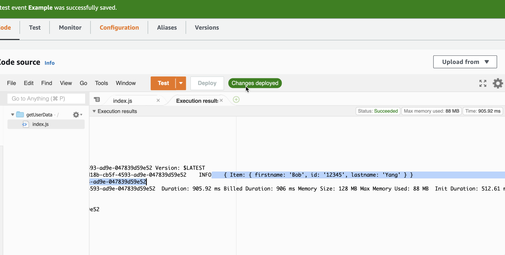
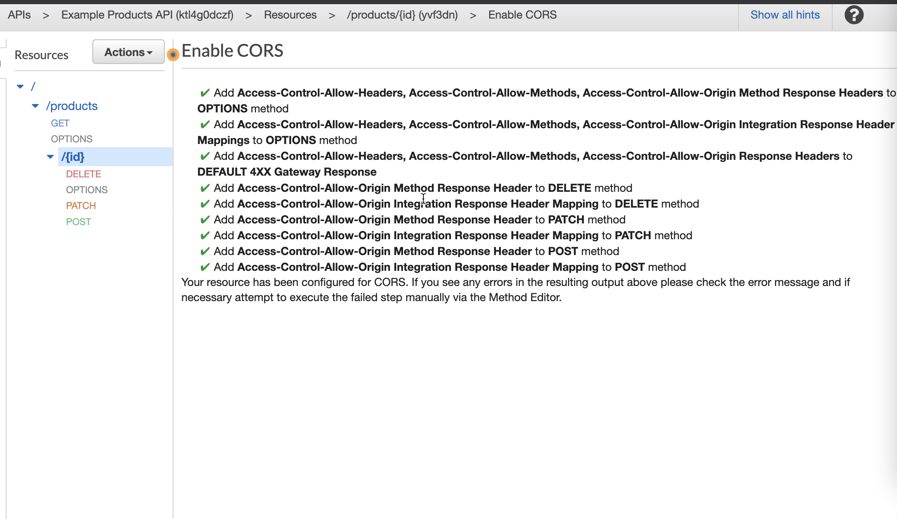

- better formatted data with documentClient

#### API GATEWAY

- Get method is nested under /products route and does not require lambda proxy as it doens;t need the event object
  
  
  

- API GATEWAY cors configure
  
  
  
